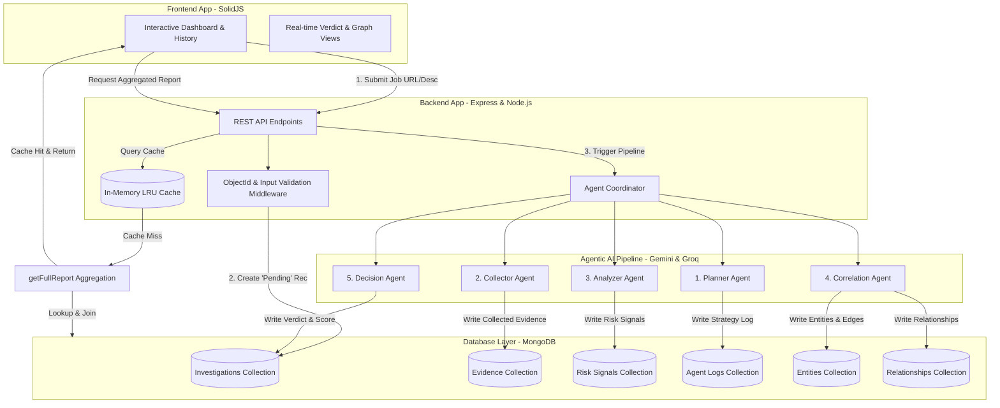

# InternShield 🛡️ — Agentic Internship Scam Detection Platform

InternShield is a state-of-the-art, full-stack **SolidJS + Express + MongoDB** platform designed to protect students and job seekers by using a multi-agentic AI pipeline to investigate internship postings and detect fraudulent schemes or scams using OSINT (Open-Source Intelligence).

This project has been meticulously optimized for a **Database Management System (DBMS) Project**, implementing high-performance MongoDB features like transaction-safe cascade deletes, compound and text indexing, automated TTL data purging, and advanced multi-stage aggregation pipelines that replace legacy N+1 query patterns.

---

## 📐 System Architecture

InternShield uses a distributed multi-agent architecture where the application layer coordinates and delegates sub-investigations to specialized AI agents, and the database acts as the central state-management engine.



---

## 🗄️ Database Schema & Optimization (DBMS Focus)

This platform showcases advanced database administration, tuning, and querying concepts:

### 1. Database Entity-Relationship (ER) Model

The DBMS manages six highly normalized collections to represent the complex lifecycle of an OSINT investigation:

```
  ┌──────────────────┐               ┌──────────────────┐
  │   AgentLog       │               │   Evidence       │
  ├──────────────────┤               ├──────────────────┤
  │ - agentName      │               │ - sourceName     │
  │ - input / output │               │ - sourceType     │
  │ - durationMs     │               │ - content        │
  │ - timestamp      │               │ - credibility    │
  └────────┬─────────┘               └────────┬─────────┘
           │ 1:N                              │ 1:N
           │                                  │
           │           ┌──────────────┐       │
           └──────────>│ Investigation│<──────┘
                       ├──────────────┤
                       │ - companyName│
                       │ - website    │
                       │ - status     │
                       │ - riskScore  │
                       │ - verdict    │
                       │ - report     │
                       └──────┬───────┘
                              │ 1:N
                              ├────────────────────────┐
                              ▼                        ▼
                      ┌──────────────┐         ┌──────────────┐
                      │   Entity     │<────────┤ Relationship │
                      ├──────────────┤  1:N    ├──────────────┤
                      │ - entityType │         │ - type       │
                      │ - entityName │         │ - weight     │
                      │ - confidence │         └──────┬───────┘
                      └──────────────┘                │
                                                      ▼
                                              (Source & Target Entities)
```

---

### 2. Advanced MongoDB Implementations

#### A. Unified Aggregation Pipeline (`getFullReport`)
Instead of issuing five separate queries across the database to compile a report (leading to high socket overhead and latency), the system executes a single **multi-stage join aggregation** (`$lookup`):
- **Stages**:
  - `$match`: Isolates the targeted investigation.
  - `$lookup` (x5): Dynamically joins related records from `evidences`, `risksignals`, `agentlogs`, `entities`, and `relationships`.
  - `$addFields`: Calculates database metrics like `evidenceCount`, `signalCount`, `avgCredibility`, and runs a dynamic conditional filter to output a `riskSignalBreakdown` (splitting warnings vs. positive indicators) directly inside the DBMS.

```javascript
// Example from server/dbPipelines.js
const pipeline = [
  { $match: { _id: id } },
  { $lookup: { from: 'evidences', localField: '_id', foreignField: 'investigationId', as: 'evidence' } },
  { $lookup: { from: 'risksignals', localField: '_id', foreignField: 'investigationId', as: 'signals' } },
  { $addFields: {
      avgCredibility: {
        $cond: {
          if: { $gt: [{ $size: '$evidence' }, 0] },
          then: { $avg: '$evidence.credibilityScore' },
          else: 0
        }
      }
  }}
];
```

#### B. Multi-Faceted Statistics Aggregation (`getDashboardStats`)
The analytical dashboard requires multiple counts, distributions, and arrays in real-time. We use **`$facet`** to execute six sub-pipelines concurrently:
1. **Overview**: Total count, completed, pending, average, maximum, and minimum risk scores.
2. **Verdict Distribution**: Group-by and count calculations on verdict labels.
3. **Risk Distribution Bucket**: Groups numerical scores (0–100) into custom histogram ranges using **`$bucket`**:
   ```javascript
   $bucket: {
     groupBy: '$riskScore',
     boundaries: [0, 20, 40, 60, 80, 101],
     default: 'Unknown',
     output: { count: { $sum: 1 } }
   }
   ```
4. **Daily Trends**: Computes aggregate averages grouped by day for the last 30 days.

#### C. ACID-Compliant Cascade Delete Transactions
Deleting an investigation requires deleting all connected records. To prevent orphan entries if a database command crashes mid-way, all operations are bound inside a **MongoDB Transaction Session**:
```javascript
const session = await mongoose.startSession();
try {
  session.startTransaction();
  await Evidence.deleteMany({ investigationId: id }, { session });
  await RiskSignal.deleteMany({ investigationId: id }, { session });
  await Entity.deleteMany({ investigationId: id }, { session });
  await Relationship.deleteMany({ investigationId: id }, { session });
  await AgentLog.deleteMany({ investigationId: id }, { session });
  await Investigation.findByIdAndDelete(id, { session });
  await session.commitTransaction();
} catch (err) {
  await session.abortTransaction();
} finally {
  session.endSession();
}
```

#### D. Database Indexing & Optimizations
- **Compound Performance Indexes**: Added keys on `{ status: 1, createdAt: -1 }` and `{ verdict: 1, riskScore: -1 }` to eliminate in-memory sorting.
- **Redundant Index Tuning**: Redundant single-field indexes were removed on fields that already act as prefixes for compound indexes, saving disk storage and write latency.
- **Automated Data Purging (TTL Index)**: Keeps the DB performant by auto-deleting `AgentLog` entries older than 90 days:
  ```javascript
  agentLogSchema.index({ timestamp: 1 }, { expireAfterSeconds: 90 * 24 * 60 * 60 });
  ```
- **Full-Text Indexing**: Enabled multi-field text indexing on `companyName` and `internshipDescription` for quick fuzzy search.

---

## ⚡ The Agentic AI Pipeline

InternShield implements a five-agent OSINT pipeline powered by **Gemini 2.0 Flash**:

1. **Planner Agent**: Reads the initial job specifications and designs a checklist of data sources and targeted OSINT searches.
2. **Collector Agent**: Gathers details from WHOIS databases, social profiles, business registries, and community feedback.
3. **Analyzer Agent**: Cross-references collected facts against common fraud criteria, generating weighted risk signals (-50 to +50 points).
4. **Correlation Agent**: Creates logical nodes (Entities) and edges (Relationships) mapping links between scammers, disposable domains, and associated emails.
5. **Decision Agent**: Synthesizes all gathered metrics, outputs the final security verdict, and compiles the report mixed output.

### 🛡️ Resiliency Safeguards
- **Exponential Backoff Retries**: AI calls automatically attempt up to 3 retries with exponential delay (`baseDelay * 2^attempt`) on network hiccups or `429 Rate Limit` responses.
- **Dynamic Fallback Provider**: If Gemini limits are reached, the system automatically redirects queries to the **Groq SDK** utilizing `Llama-3.3-70B`.
- **Pipeline Timeout Guard**: A 3-minute execution limit prevents AI hangs from locking up background resources.

---

## 💻 Tech Stack

- **Frontend**: [SolidJS](https://solidjs.com/) + TailwindCSS (for reactive, extremely fast UI renders with no virtual DOM overhead).
- **Backend**: Node.js + [Express](https://expressjs.com/) (RESTful API server).
- **Database**: [MongoDB](https://www.mongodb.com/) via [Mongoose](https://mongoosejs.com/).
- **AI Engines**: Google Gemini API (`gemini-2.0-flash`) & Groq SDK (`llama-3.3-70b-versatile`).

---

## 🛠️ Installation & Setup

All project dependencies have been pre-installed in both the root backend and the `client` directory.

### 1. Configure Environment Variables

A working `.env` file has been created in the root directory. Make sure to configure your MongoDB connection string and API keys (if applicable):

```env
PORT=5002
MONGODB_URI=mongodb://localhost:27017/internshield
JWT_SECRET=internshield_jwt_secret_key_2024
CLIENT_URL=http://localhost:5173
GEMINI_API_KEY=your_google_gemini_api_key_here
GROQ_API_KEY=your_groq_api_key_here
```

> 💡 **Offline Sandbox Mode**: If you do not provide a `GEMINI_API_KEY`, the agent pipeline automatically falls back to an elegant mock engine that generates highly realistic evidence, graph relationships, and logs for offline demonstration purposes.

---

## ⚡ Running the Platform

### Running the Backend Server
From the root directory, start the server with auto-reload enabled:
```bash
npm run dev
```
*The API will start running at `http://localhost:5002`.*

### Running the Frontend Client
Open a separate terminal window, navigate to the `client` directory, and start the Vite dev server:
```bash
cd client
npm run dev
```
*The UI will start running at `http://localhost:5173`.*

---

## 📊 Database Aggregation Showcase (API Endpoints)

- **Health Check**: `GET /api/health` — Returns DB connection states and server uptime.
- **Dashboard Stats**: `GET /api/stats` — Uses `$facet`, `$group`, and `$bucket` aggregations.
- **Paginated Search**: `GET /api/investigations/search?q=google&status=completed&page=1&limit=10` — Uses `$facet` and `$text` indexes.
- **Unified Report**: `GET /api/report/:investigationId` — Employs a complex multi-join `$lookup`.
- **Evidence Grouping**: `GET /api/evidence/:investigationId/analysis` — Uses `$group` and credibility analysis.
- **Knowledge Graph**: `GET /api/graph/:investigationId` — Fetches relational nodes and edges for visualization.
- **Cascade Delete**: `DELETE /api/investigations/:id` — Safely and transactionally wipes out all associated records.